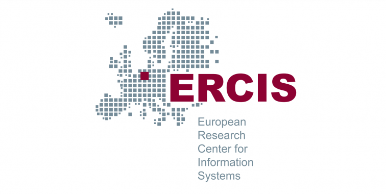

Die E-Paper von Waveshare in Verbindung mit den ESP-32 zeigen jetzt nach erfolgreicher Implementierung, ein vom Server empfangenes Hex-Array, als Bild auf dem E-INK Display an. Davor konnten wir schon den Hex-Array empfangen aber beim Prozess ihn dem Bildschirm bereitzustellen gab es noch Probleme. Das Bild wurde zwar angezeigt, aber es war verzerrt und nicht in der gewünschten Form. Dafür haben wir den Code noch einmal überarbeitet. Die Funktion, die die Werte richtig für den Eink abspeichert, musste angepasst werden, weil sie den String von Werten nicht richtig aufgeteilt hat. Außerdem haben wir gesehen das HTTP-Response nur einen String entgegennimmt, aber das ein String nicht lang genug war um all die Daten zu speichern. Deswegen haben wir die Response in erstmal auf zwei Strings verteilt.

Als Nächstes werden wir versuchen das ganze Bild anzuzeigen. Dafür müssen wir wahrscheinlich wieder etwas anpassen. Außerdem können wir schon überlegen wie das später Funktionieren soll. Wahrscheinlich hat jeder E-Ink einen eigenen Link, der das Passende Bild für seinen Raum enthält. Es gäbe also eine eigene Seite pro Raum. Und der Code müsste vor den hochladen auf den ESP jeweils mit dem richtigen Link für den jeweiligen Raum angepasst werden. 

