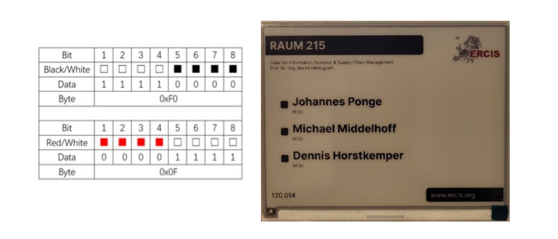

## E-Ink
Neues zum aktuellen Stand am 28.06.2023. Die Kommunikation zwischen E-Ink und ESP32 funktioniert schon gut. Der ESP32 kann von der vorgegebenen Website das von uns gewünschte Bild abrufen und dann richtig an den E-Ink weiterleiten. Um das möglich zu machen, mussten wir das Bild anpassen. Ein E-Ink Bildschirm mit mehr als schwarz-weiß empfängt nämlich mehrere Bilder. In unserem Fall, rot-schwarz-weiß, **zwei** Bilder.  Eins mit nur in rot und weiß und das andere mit schwarz und weiß. Beide in der gleichen Pixel Zahl unseres Bildschirmes, hier 5.83inch mit 648×480 Pixel. Außerdem haben wir einen Deep Sleep Modus eingebaut, hiermit sollte alles auf längere Zeit autonom laufen. Wir müssen demnächst konkreter den Stromkonsum messen aber in einem ersten Test hat sich nach mehrmaligem aktualisieren der Akkustand nicht merklich verändert. Außerdem ist das System jetzt robuster. Zum Beispiel um Endlosschleifen beim Verbinden mit dem WIFI zu vermeiden. Soweit so gut.

## Raspberry Pi
Bei den Raspberry Pis hatten wir den **Pi 3** schon im Kiosk Mode so vorbereitet das er unsere Anzeige mit Karte und allem anzeigt. Es gab Performance Probleme, aber mittlerweile wurden Anpassungen gemacht zum Optimieren und die Animationen sollten flüssiger sein, vor allem auf einen **Raspberry Pi 4** auf dem sie ja am Ende laufen sollten. Leider gelang es letzte Woche nicht ihn erfolgreich zu starten. Möglicherweise ist ein Ersatz nötig.
