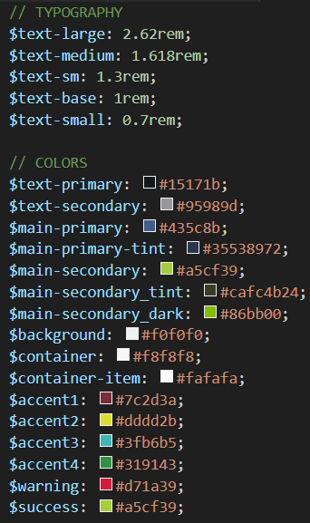

Herzlich willkommen zu unserem neuen Blogbeitrag! Heute stelle ich euch unsere genutzten Sprachen bzw. Frameworks aus dem Frontend vor und gehe auf die Vor- sowie Nachteile der genutzten Technologien ein.

Für ein effizientes Frontend ist es entscheidend, die richtigen Technologien und Frameworks  zu wählen. Bei dem Touchdisplay im Eingangsbereich haben wir uns für eine Kombination aus HTML, SCSS und Next.js entschieden, um sowohl das Styling, die Funktionalität als auch die Strukturierung unserer Anwendung zu verbessern. In diesem Blogbeitrag werde ich die Vor- und Nachteile dieser Technologien im Frontend diskutieren und euch einen Einblick in unsere Erfahrungen geben.

## Vorteile von SCSS
1. Vereinfachte Stylesheet-Erstellung: SCSS (Sassy CSS) ist eine CSS-Vorverarbeitungssprache, die über eine erweiterte Syntax und Funktionen verfügt. Es ermöglicht die Verwendung von Variablen, verschachtelten Selektoren, Mixins und vielem mehr. Dadurch wird die Erstellung und Organisation von Stylesheets deutlich erleichtert und beschleunigt. So haben wir beispielsweise globale Variablen für einheitliche Schriftgrößen, Farben oder Außenabstände erstellt. Das sieht man im folgenden Bild:

2. Bessere Lesbarkeit: Die verschachtelte Syntax von SCSS ermöglicht eine klarere und lesbarere Strukturierung des Codes. Durch die Verschachtelung von Selektoren können Sie die Beziehung zwischen Elementen deutlich machen und den CSS-Code besser nachvollziehbar machen.

## Vorteile von Next.js
1. Serverseitiges Rendern (SSR): Next.js ermöglicht das serverseitige Rendern von Webseiten. Dadurch werden die Ladezeiten optimiert und eine bessere Leistung erzielt. Inhalte können auf dem Server generiert und an den Client gesendet werden, wodurch eine schnellere initiale Seitendarstellung möglich ist.

2. Einfache Integration von React: Next.js baut auf React auf und bietet eine nahtlose Integration. Wenn Sie bereits mit React vertraut sind, ist der Einstieg in Next.js relativ einfach. Sie können die Vorteile der React-Komponentenarchitektur nutzen und gleichzeitig von den erweiterten Funktionen und der Routing-Unterstützung von Next.js profitieren.

3. Statisches Site-Rendering (SSG): Neben SSR unterstützt Next.js auch das statische Site-Rendering. Das bedeutet, dass Seiten zur Build-Zeit als statische Dateien generiert werden können. Dies verbessert die Ladezeiten und die Skalierbarkeit, insbesondere für Inhalte, die sich selten ändern.

## Vorteile von HTML
1. Strukturierung der Inhalte: HTML (Hypertext Markup Language) ist die Grundlage des World Wide Web und ermöglicht die strukturierte Darstellung von Inhalten. Es definiert die Elemente und Tags, mit denen Sie die verschiedenen Teile einer Webseite wie Überschriften, Absätze, Listen und mehr definieren können. Durch die Verwendung von HTML können Sie die Inhalte Ihrer Webseite logisch und semantisch strukturieren.

2. Lesbarkeit: Durch die Verwendung von semantischen Tags und Attributen kann sichergestellt werden, dass die Anwendung richtig interpretiert wird. Dies verbessert die Benutzererfahrung und die Auffindbarkeit der Inhalte. So haben wir beispielsweise in der Cafeteriaplan-Komponente Klassennamen wie "dateText" verwendet, um deutlich zu machen, dass es sich hierbei um das ausgeschriebene Datum handelt.

3. Erweiterbarkeit: HTML bietet eine solide Grundlage für die Erweiterung einer Anwendung mit zusätzlichen Technologien. So haben wir schließlich HTML mit SCSS für das Styling, und Next.Js für die Interaktion genutzt.

## Nachteile von SCSS, Next.js und HTML
Es ist wichtig, auch die potenziellen Nachteile unserer gewählten Technologien zu berücksichtigen:

1. Lernkurve: Die Einarbeitung in SCSS, Next.js und HTML kann einige Zeit und Anstrengung erfordern, insbesondere für Anfänger, die damit nicht vertraut sind, was bei einem Projektseminar nicht unüblich ist. Es ist wichtig, die erforderliche Zeit für das Erlernen und Anwenden dieser Technologien in einem Projekt zu berücksichtigen.

2. Komplexität: Mit fortschreitendem Projektumfang können SCSS, Next.js und HTML komplexer werden. Die Verwaltung von Abhängigkeiten, die Strukturierung des Codes und die Optimierung der Leistung können zusätzliche Herausforderungen mit sich bringen. Eine sorgfältige Planung und ein guter Entwurf sind wichtig, um diese Komplexität zu bewältigen.

## Fazit
Die Kombination von SCSS, Next.js und HTML im Frontend kann viele Vorteile bieten, einschließlich einer verbesserten Codeorganisation, besserer Leistung, einer optimierten Seitendarstellung und einer semantisch strukturierten Webseite. Es ist jedoch wichtig, die potenziellen Herausforderungen wie die Lernkurve und die Komplexität zu berücksichtigen. Durch die Nutzung dieses Tech Stacks im Frontend können wir ein leistungsstarkes und gut strukturiertes Display entwickeln, das hoffentlich allen Anforderungen unseres Projektes gerecht wird.

_Vielen Dank, dass ihr unseren Blogbeitrag gelesen habt. Wir hoffen, dass ihr einige wertvolle Einblicke in die unser Frontend gewonnen habt. Wenn ihr Fragen habt oder weitere Informationen benötigt, zögert nicht, uns zu kontaktieren._

**Bis bald!**

**Euer Team von PS HouseTech**

