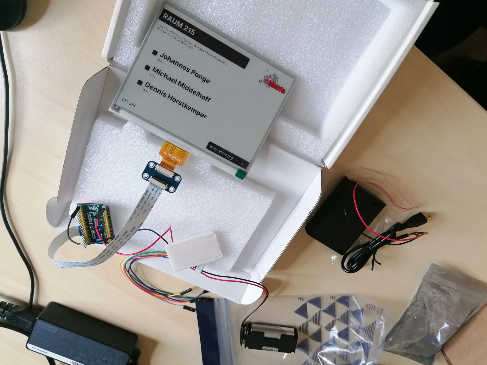
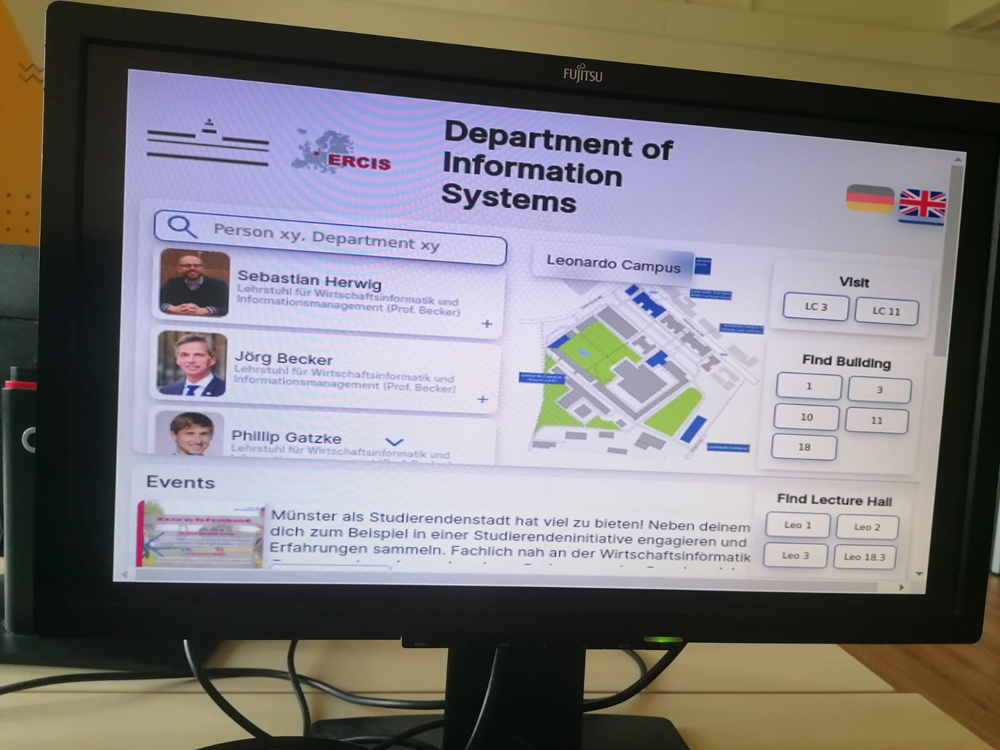

## E-Ink Energiezufuhr
Neues zum aktuellen Stand am 26.07.2023. Wir haben vor kurzem Funktionen implementiert, die das gewünschte Türschildbild serverseitig generieren können. Dies kann dann im Richtigen Format vom ESP32 eingelesen werden. Jeder ESP32 muss dafür nur am Anfang bei der Inbetriebsetzung die richtige Raumnummer zugeordnet bekommen. Danach kann jeder einzeln respektiv die passende Anzeige runterladen.
Bei der Stromversorgung haben wir uns für Lithium AA Batterien entscheiden. Die Powerbank, und Powerbanken allgemein schalten sich nämlich von allein aus nach ungefähr einer Minute, in der zu wenig Strom verbraucht wird. Das ist aber beim Deep Sleep genau der Fall, und verursacht so, dass der ESP32 ohne externes agieren nicht wieder aufwacht. Deswegen brauchen wir eine alternative und Lithium Batterien schienen am besten dafür geeignet zu sein.
 Lithium Batterien halten lange die Spannung eine 1,5V Batterie bleibt lange bei 1,5V, bei 1,35V sind schon 90% der Kapazität aufgebraucht. Und bei 1,275V leer. Mit jeweils 2 oder 3 Batterien können die jeweiligen Spannungsvoraussetzungen eingehalten werden. Dann hätten wir jeweils 3V oder 4,5V.  Es gibt zwei Arten den ESP32 mit Strom zu versorgen, durch den Micro USB 5V oder direkt durch den 3v3 Pin (auch VDD) (+ Rotes Kabel) und den GND-Pin (ground) (- Schwarzes Kabel).

Die USB-Schnittstelle (5V) verlangt zwischen 3.6V und 5.5V. 
 
Bei 3v3 ist eine Spannungsversorgung von 2,5V bis 3,6 V zu gewährleisten.

Bei mehr können Komponenten geschädigt werden da der ESP32 Spannungsumwandler umgangen wird. Mit 2 oder 3 Batterien werden die Bedingungen gut eingehalten.

## Raspberry Pi Kiosk 

# implementation  

Für den Kiosk Modus des Raspberry Pi 4 haben wir Fullpageos verwendet. Weil anfangs das Signal nicht stark genug war, konnten wir kein Bild anzeigen. Danach ging es aber mit anderen Einstellungen. Um ihn anzupassen haben wir den Link unserer Website und unser Logo eingefügt.

# result
Wir haben den **Raspberry Pi 3** schon im Kiosk Mode an einen Bildschirm angeschlossen und gesehen das er gut die Webseite anzeigt und wir ein gutes Bild haben. Trotzdem haben wir aber auch schnell gesehen,dass unsere Anzeige der Karte mit den Informationen sehr verzögert anzeigt. Um die performance Probleme zu beheben haben wir erstmal den **Pi 4** übertaktet.
Leider reicht auch das nicht aus und die Animationen sind weniger flüssig als sie sollten. 

