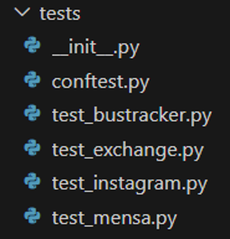
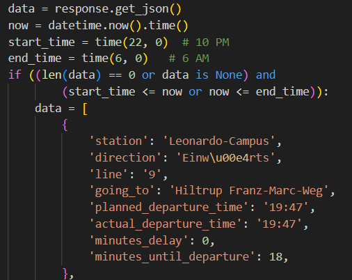
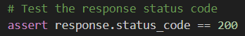
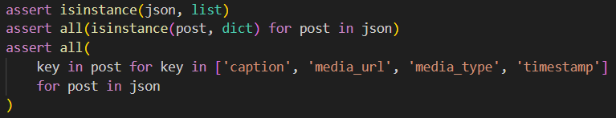
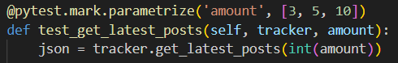

Herzlich willkommen zu unserem neuen Blogbeitrag! Heute stelle ich euch das Testen von Klassen in Python vor und stelle die Vorteile sowie die Szenarien vor, die abgedeckt werden müssen. Bei den Szenarien gebe ich euch dann jeweils ein Beispiel aus unserem Projekt.

# Testen von Klassen in Python: Umgang mit API-Responses

Das Testen von Klassen ist ein entscheidender Schritt im Entwicklungsprozess von (Python-)Anwendungen, um sicherzustellen, dass der Code korrekt funktioniert und zuverlässig ist. Besonders beim Testen von Klassen, die mit externen APIs interagieren und API-Responses verarbeiten, gibt es einige wichtige Punkte zu beachten. In diesem Artikel werfen wir einen Blick auf bewährte Teststrategien, um sicherzustellen, dass unsere Klassen ordnungsgemäß funktionieren, wenn sie mit API-Daten arbeiten.

## Warum Klassen testen?

Klassen sind die Bausteine vieler Python-Anwendungen, und ihre ordnungsgemäße Funktionsweise ist von entscheidender Bedeutung für den Erfolg der Software. Durch das Testen von Klassen können wir sicherstellen, dass sie die erwarteten Ergebnisse liefern und dass mögliche Fehler oder Probleme rechtzeitig erkannt werden.

Das Testen von Klassen bietet mehrere Vorteile:

1. **Zuverlässigkeit**: Durch das Testen können wir sicherstellen, dass die Funktionalität unserer Klassen genau so arbeitet, wie wir es erwarten.

2. **Refaktorisierung**: Tests ermöglichen es uns, den Code zu ändern oder zu verbessern, ohne dass unerwünschte Nebenwirkungen auftreten.

3. **Dokumentation**: Testfälle dienen als Dokumentation und zeigen anderen Entwicklern, wie die Klassen verwendet werden können.

4. **Sicherheit**: Tests können dazu beitragen, Sicherheitslücken zu erkennen und zu schließen.

## Testen von Klassen mit API-Responses

Wenn Klassen API-Responses verarbeiten, sollten wir sicherstellen, dass unsere Tests alle möglichen Szenarien abdecken. Hier sind einige wichtige Aspekte, auf die wir beim Testen von Klassen mit API-Responses achten sollten:

### 1. **Mocking der API-Aufrufe**: 

Um unabhängige Tests durchzuführen und nicht von der Verfügbarkeit der tatsächlichen API abhängig zu sein, sollten wir die API-Aufrufe mocken. Das bedeutet, dass wir eine vordefinierte API-Response simulieren, die unsere Klassen während der Tests verwenden können. Dadurch können wir die verschiedenen Verhaltensweisen und Fehlerzustände der API kontrollieren und gezielt testen, wie unsere Klassen darauf reagieren. Dies ist beispielsweise bei der Bustracker-Klasse der Fall, wenn wir nachts keine Busdaten erhalten, dennoch testen möchten.

### 2. **Test auf HTTP-Statuscodes**: 

API-Responses enthalten normalerweise HTTP-Statuscodes, die den Erfolgs- oder Fehlerstatus der Anfrage anzeigen. Unsere Tests sollten überprüfen, ob unsere Klassen korrekt auf verschiedene Statuscodes reagieren, z. B. 200 (OK), 404 (Not Found), 500 (Internal Server Error) usw. Idealerweise erhalten wir den Statuscode 200 und können die Daten verarbeiten.

### 3. **Überprüfung der Datenintegrität**: 

API-Responses enthalten häufig komplexe Datenstrukturen wie JSON oder XML. Unsere Tests sollten sicherstellen, dass unsere Klassen die Daten korrekt verarbeiten und die erwarteten Informationen extrahieren können. Wir können überprüfen, ob die richtigen Schlüssel vorhanden sind und ob die Werte den erwarteten Typen entsprechen. Schauen wir dabei beispielsweise in die Instagram-Klasse, testen wir, ob die latest_posts als JSON zurückkommen.

### 4. **Behandlung von Fehlern und Ausnahmen**: 

API-Aufrufe können fehlschlagen oder unerwartete Ausnahmen verursachen. Unsere Klassen sollten robust sein und auf solche Situationen angemessen reagieren. Unsere Tests sollten sicherstellen, dass unsere Klassen fehlerfrei mit verschiedenen Ausnahmen umgehen können. Dabei können wir beispielsweise von pytest.xfail oder pytest.xskip Gebrauch machen, welche mit fehlschlagenden Tests oder falsch ankommenden Daten umgehen können.

### 5. **Testen von Paginierung und Datenmenge**: 

Einige APIs liefern Daten in paginierten Ergebnissen. Unsere Klassen müssen in der Lage sein, mehrere API-Aufrufe zu verarbeiten und die Daten korrekt zusammenzuführen. Unsere Tests sollten dies überprüfen, indem sie verschiedene Szenarien mit unterschiedlichen Datenmengen testen. So haben wir in der Instagram-Testklasse auf unterschiedlich viel ankommende latest_posts getestet.

## Fazit

Das Testen von Klassen, die mit API-Responses arbeiten, ist eine kritische Komponente im Entwicklungsprozess von (Python-)Anwendungen. Durch das Mocken der API-Aufrufe, das Testen von HTTP-Statuscodes, die Überprüfung der Datenintegrität und die Behandlung von Fehlern können wir sicherstellen, dass unsere Klassen zuverlässig funktionieren und alle möglichen Szenarien abdecken. Eine gründliche Testabdeckung ermöglicht es uns, qualitativ hochwertigen Code zu schreiben und eine stab

_Vielen Dank, dass ihr unseren Blogbeitrag gelesen habt. Wir hoffen, dass ihr einige wertvolle Einblicke in das Testen von Klassen gewonnen habt. Wenn ihr Fragen habt oder weitere Informationen benötigt, zögert nicht, uns zu kontaktieren._

**Bis bald!**

**Euer Team von PS HouseTech**

