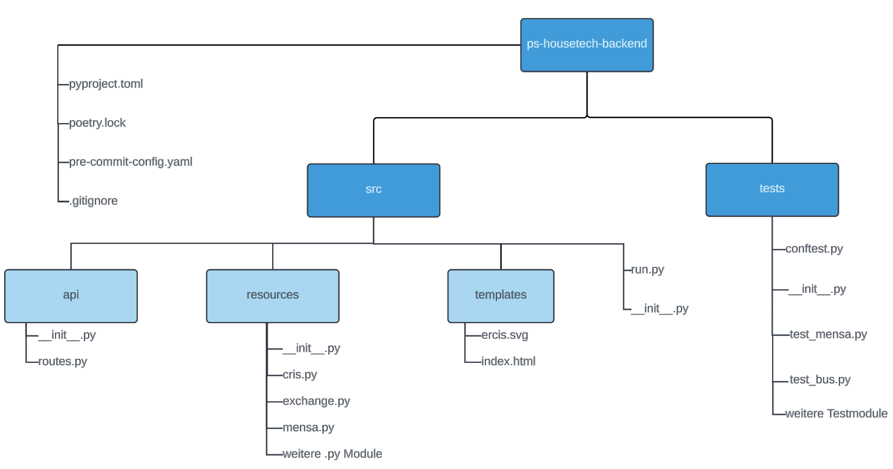

# Einleitung 
Die vorliegende Dokumentation beschreibt das Backend für die Informationsdisplays, E-Ink Displays und den Exchange-Kalender, welche unter Verwendung des Flask-Webframeworks entwickelt wurde. Das Backend spielt in der Applikation eine große Rolle und übernimmt die komplette Konsolidierung und Bereitstellung der meisten  Informationen auf entwickelten Applikationen.

## Warum Flask?
Als Mikro-Webframework ermöglicht Flask eine schnelle und effiziente Entwicklung, ohne unnötige Komplexität hinzuzufügen. Seine Leichtigkeit und Flexibilität erlauben eine nahtlose Integration mit verschiedenen Datenquellen. Darüber hinaus unterstützt Flask eine modulare Architektur, die das System einfach skalierbar und wartbar macht, zwei wesentliche Aspekte für eine nachhaltige und zuverlässige Lösung im universitären Umfeld. Außerdem erlaubte uns diese Auswahl umfangreiche Tests zu formulieren um qualitative Software gewährleisten zu können.In den folgenden Abschnitten wird detailliert auf die Architektur, die Funktionalitäten und die Implementierung dieses Backend-Systems eingegangen. 

## Die Struktur des Backend 
Bei der Struktur der Flask Application verfolgten wir einen möglichst modularen Ansatz, der die Weiterentwicklung und Wartung für nachfolgende Mitwirkende vereinfachen soll. Um die Modularität der Applikation zu gewährleisten, setzten wir auf das verbreitete "Flask Application Factory" Entwurfsmuster, indem wir bei Start des Backends eine Instanz der Flask app erzeugen und jegliche Zusatzfunktionen (z.B Cache oder Blueprints) direkt mit initialisieren. Mehr zum "Flask Application Factory" kann [hier](https://flask.palletsprojects.com/en/2.3.x/patterns/appfactories/) nachgelesen werden.

Die vollständige Projektstruktur des Backends kann grob visualisiert werden:

Das Backend ist aufgeteilt in einen `src` und einen `test` Ordner. Grundsätzlich verfügt jeder Order mit Python-Modulen über eine `__init__.py` Datei, welche den Ordner in ein Python-Package formatiert. Dies vereinfachert das importieren von Code aus verschiedenen Ordnern, bei dem ausschließlich auf absolute imports gesetzt wurde. Mehr zu absoluten Imports und Python Packages kann [hier](https://docs.python.org/3/tutorial/modules.html) nachgelesen werden.

### Root-Directory 
 Im Root-Directory `ps-housetech-backend` liegen zum einen ein `.gitignore` File in dem festgeschrieben ist, welche Dateien nicht auf GitLab gepusht werden sollen und zudem zwei Dateien unseres Package-Manager namens Poetry (`pyptoject-toml` und `poetry.lock`). Poetry kümmert sich um die Abhängigkeiten unseres Projekts und vereinfacht die Erstellung, Veröffentlichung und Installation von Paketen (Infos zur [Installation von Poetry](https://ml-de.zivgitlabpages.uni-muenster.de/teaching/ps-housetech/ps-housetech-website/docs/server/Backend/poetry)). Die Bedienung von Poetry ist einfach und konsistent, wobei alle notwendigen Funktionen unter einer einheitlichen Befehlszeilenschnittstelle zusammengefasst sind. Die `pyproject.toml` Datei ist das Hauptkonfigurationsfile eines Poetry-Projekts. In dieser Datei definiert man alle Abhängigkeiten, sowohl für die Produktion als auch für die Entwicklung, und andere Metadaten wie die verwendete Python-Version oder Skripte. Die `poetry.lock` Datei wird von Poetry selbst generiert und enthält die exakten Versionen der Pakete, die unser Projekt benötigt. Dadurch wird sichergestellt, dass das Projekt überall gleich funktioniert, unabhängig davon, wann und wo es installiert wird. Diese Datei sollte im Versionierungssystem (wie Git) enthalten sein, damit jeder, der an dem Projekt arbeitet, dieselben Abhängigkeitsversionen hat. Nach der Installation von poetry können alle in der `pyproject.toml` definierten Abhängigkeiten mittels des Command `poetry install` installiert werden. Weitere wichtige Commands in der Anwendung von Poetry sind [hier](https://python-poetry.org/docs/cli/) zu finden. Außerdem im Root-Directory zu finden ist die `pre-commit-config.yaml` Datei des pre-commit Frameworks. Dieses Framework ist ein nützliches Werkzeug, um die Qualität deines Codes zu erhöhen und häufige Fehler frühzeitig zu erkennen. Beispielsweise verwenden wir eine Reihe von vordefinierten Hooks, wie Code-Formatter, Linter, Syntaxprüfer, etc, die bei jedem commit ausgeführt werden. Ohne das passieren aller Hooks, schlägt der commit fehl.

### src-Directory
Im `src` Package unseres Backend befindet sich die gesamte Logik. Das `src` Package ist grob in die drei Packages `api`, `resources` und `templates` aufgeteilt. Auf der gleichen Ebene wie  befindet sich die `run.py` Datei, welche bei Ausführung die App initialisiert. 
Schauen wir uns zunächst die Module innerhalb des `resources` Package an:

#### `bustracker.py`:
Im Bustracker-Modul wird die [Bus-API der Stadtwerke Münster](https://api.busradar.conterra.de/#/) abgefragt, welche diverse Daten für Bushaltestellen und Busse bereitstellt. Im Wesentlichen wird die Antwort dieser API verarbeitet und weitere Informationen werden errechnet um alle benötigten Informationen zu erhalten. Außerdem verfügt das Modul über eine Übersetzungsmethode, die für die englische Version Begriffe wie "Hbf" o.Ä. übersetzt. Aktuell werden ausschließlich die Station Leonardo-Campus in beide Richtungen erfasst. 

#### `cris.py`:
Im Cris-Modul wird die [CRIS Graph-QL-API der Universität Münster](https://confluence.uni-muenster.de/display/CRISWWU/CRIS-GraphQL-API) abgefragt. Diese API hat für die Informationsdisplays zwei übergeordnete Zwecke. Erstens werden Personenabfragen zu Mitarbeitenden des Instituts durchgeführt, da für das Informationsdisplay Daten wie Vorname, Nachname, Titel, Email, Telefonnummer und Raumnummer benötigt werden um eine geeignete Personensuche implementieren zu können. Außerdem wird die CRIS-API für die Erstellung von digitalen Türschildern mittels der E-Ink Displays genutzt um die richtigen Personen einem bestimmten Raum zuordnen zu können. 
Aufgrund von Restriktionen der Cris API sowie der Zuordnung von Mitarbeitenden an mehreren Lehrstühlen stellte sich dieses Modul als durchaus komplex heraus. Der Ablauf der Abfrage ist folgendermaßen implementiert:

1. Zunächst wird durch alle zugehörigen Lehrstühle (chairs) iteriert, die wir zuvor in der Datei fest implementiert haben. Für jeden Lehrstuhl werden alle aktiven `employee_ids`, sowie die dazugehörige `chair_name` der Person der employees-Liste angehangen. 
2. Nachdem alle Organisationen durchlaufen wurden, befinden sich nun alle Mitarbeitenden in der besagten employee-Liste. Allerdings sind einige Mitarbeitende mehreren Organisationen/Lehrstühlen zugeordnet, weswegen wir im  Duplikate entfernen müssen. Nun können wir davon ausgehen, dass sich jede Person `employee_id` nur ein Mal in unserer Liste befindet
3. Anschließend an die Duplikatsentfernung werden den Mitarbeitenden personenspezifische Daten zugeordnet. Da die CRIS-API maximal 100 `employee_ids` als Input zulässt, erstellen wir mehrere Listen mit maximal 100 `employee_ids`, für die wir jeweils eine Abfrage ausführen.
4. Nun verfügen wir über die personenspezifischen Daten, darunter: Vor- und Nachname, E-Mails, jobTitle, Telefonnummern, eine image-id, card-ids für die aktiven Karten der Person und die Raumnummer. Was wir allerdings noch nicht wissen, ist die genaue Lehrstuhl-Zuordnung einer Person.
5. Für die Lehrstuhl Zuordnung nutzen wir die card-ids der jeweiligen Personen. Wir haben bereits ausschließlich die aktiven Karten (meistens nur eine pro Person) gespeichert und können uns über diese Karte den Lehrstuhl erschließen. Damit die Schnelligkeit der Abfrage so wenig wie möglich leidet, wird auch hier immer eine Abfrage für 100 card-ids, ähnlich wie bei den Personendaten ausgeführt. Allerdings wird sich hier auch für jede Karte gemerkt, zu welcher Person diese gehört, da einige Personen mehrere Karten haben und somit auch mehreren Lehrstühlen zugeordnet sein können. 
7. Lehrstühle werden ggf. ins Englische übersetzt. Dafür verwenden wir eine `cris_en.yml` Datei, sowie die `get_translation` Methode.
8. Es verbleiben drei Herausforderungen: 
    1. Einige Personen müssen herausgefiltert werden, das sich bei der zuverlässigen Lehstuhl-Zuordnung herausgestellt hat, dass diese Person nicht mehr an einem Lehrstuhl des Institut tätig ist.
    2. Außerdem sollen Personen mit bestimmten Arbeitsverhältnissen (SHKs) nicht angezeigt werden. 
    3. Jede Person benötigt zusätzlich eine Adresse, die ihr zugeordnet wird.

Für i) ii) und werden Filter angewendet und Personen aussortiert. Für die Lehrstuhl-Zurodnung wird betrachtet, ob eine Person mindestens einem der vordefinierten Lehrstühlen angehörig ist. Für den Filter nach Jobtiteln wird geschaut, ob die Jobtitel einer Person mindestens einem der `valid_job_titles` entsprechen.

Die Zuordnung des Gebäudes ist potenziell ausbaufähig, da lediglich alle Mitarbeitenden der Lehrstühle von Prof. Klein und Prof. Berger dem Leonardo-Campus 11 zugeordnet werden, während der Rest dem Leonardo-Campus 3 zugeordnet wird. 

**Hinzufügen von neuen Lehrstühlen:** Hierzu muss lediglich ein Eintrag in der `self.chairs` Liste vorgenommen werden. Außerdem sollte eine Übersetzung des Lehrstuhls in der `cris_en.yml` Datei eingetragen werden.

#### `drupal.py`:
Das Drupal-Modul vermittelt den Inhalt der Drupal-Overlays und Events and das Frontend. Dabei wird lediglich der Inhalt von zwei verschiedenen URLs verarbeitet, die im Modul eingesehen werden können. Hinter den URLs befinden sich Drupal-Module, auf die sich verlassen wird.

#### `einkgenerator.py`:
Dieses Modul erzeugt für einen angegebenen Raum im Leonardo-Campus 3 ein HexArray, aus welchem die E-Ink-Displays das Türschild generieren können. Der Erstellungsprozess eines Türschild im Backend besteht aus mehreren Schritten: 

1. Für den angegebenen Raum sucht das Modul mittels der CRIS-API nach den zugehörigen Mitarbeitenden des Raumes. 
2. Die Informationen der Mitarbeitenden werden in ein HTML-Template eingefügt, wo auch die Raumnummer ausgetauscht wird.
3. Das generierte HTML wird mittels der HTML2Image Bibliothek in ein .png Bild verwandelt (per Screenshot).
4. Aus dem Bild kann nun ein HexArray aus Farbcodes erstellt werden, welches nach einigen weiteren Anpassungen zurückgegeben wird.

Das HTML-Template und das ERCIS-Logo befinden sich im `templates` Ordner.

#### `event.py`:
Dieses Modul wurde entwickelt, um dem Frontend Feiertage und anderweitige Events mitzuteilen. Mittels eines Enums erhält das Frontend eine Zahl als Rückgabewert für die eine Konfiguration im Frontend hinterlegt sein kann. Aktuell sind im Frontend noch keine Konfigurationen festgelegt.

#### `exchange.py`:
Das Exchange-Modul baut eine Verbindung zum Exchange-Server mit vorhandenen Credentials auf, und ruft Kalenderereignisse für mindestens fünf Exchange Server Raumressourcen mit diesen Credentials ab. Gibt die Startzeit, die Endzeit, den Titel, den Organisator und die E-Mail-Adresse des Organisators des Kalenderereignisses zurück.

#### `instagram.py`:
Das Instagram-Modul fragt Informationen der [Instagram-Graph-API](https://developers.facebook.com/docs/instagram-api) an. Zum Einen werden die Bilder und Bildbeschreibungen des WI-Instagram Accounts abgefragt. Außerdem können auch hochgeladenen Videos/Instagram-Reels an das Frontend weitergeleitet werden.

#### `mensa.py`:
Das Mensa-Modul fragt Informationen zum Speiseplan in verschiedenen Mensen in Münster ab. Unter den Mensen befinden sich: Mensa DaVinci, Mensa Bispinghof, Mensa am Aasee und die Mensa am Ring. Die Informationen werden aus verschiedenen XML-Dateien des Studierendenwerks bezogen. Die URLs können im Mensa-Modul eingesehen werden. Die XML-Dateien werden in Python zu einer JSON-Ausgabe transformiert.

#### `picture.py`:
Das Picture-Modul wird mit einer Image-ID aufgerufen und hat als Rückgabewert ein Bild der dazugehörigen Person. Die Image-ID wird im CRIS-Modul zu jeder Person abgefragt, mit welcher dann eine URL aufgerufen wird. Der Base-64 blob, der sich auf der aufgerufenen URL in einem XML-Format befindet, kann dann verarbeitet werden.
Da die Bilder teilweise eine Größe von über 25MB haben, werden sich im Backend aus Gründen der Performance komprimiert und anschließend zurückgegeben.

#### `proxy_config.py`:
In der proxy_config Datei werden die HTTP und HTTPS proxies gesetzt, welche für die Anfragen zum Einsatz kommen sollen, die externe Informationen (außerhalb der Uni) abfragen. Dazu gehört beispielsweise die 
Abfrage für das Wetter.

#### `tracker.py`:
This module contains the super-class which sets the proxies out of the `proxy_config.py` module and other configurations. Other Modules inherit from the class in this module. 

#### `weather.py`:
This module uses the [OpenWeatherMap API](https://openweathermap.org/api) to extract weather data. In total there are three kinds of weather data we extract: 

1. The current weather, meaning the degrees.
2. The weather forecast for the next few hours, including the Probability of Precipitation (PoP) and the expected temperature.
3. The weather forecast for the next three days, including the expected maximum temperature on each day and the estimated PoP.

### Testing 
 Neben einer Konfiguerationsdatei `conftest.py` befindet sich im "test" Ordner für jedes externe Modul, bzw. jeden implementierten API-Endpunkt eine Testdatei, die die gewünschte Funktionalität prüft. Diese Tests werden sowohl bei jedem commit automatisch lokal ausgeführt und zusätzlich bei jedem neuen Deployment des Backend auf dem Server laufen gelassen. Ohne das Bestehen aller Tests kann und sollte also weder gepusht, noch neu deployed werden. 