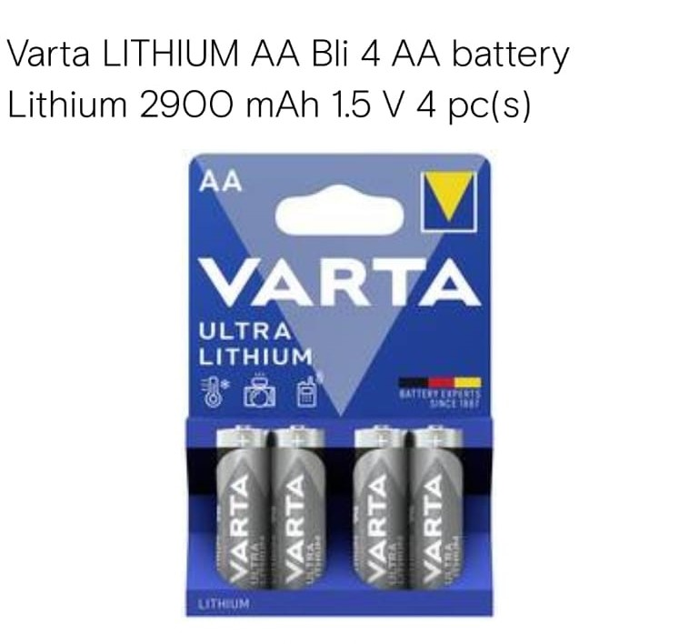

## E-Ink von oben 

## ESP von oben

## Akkus

## Kabel zur Verbindung zwischen E-Ink und ESP32

## Verkabelung ESP32, E-Ink und Computer

## Verkabelung ESP32, E-Ink und Battery

### Board Schalter
Auf unserem ESP32, dem E-Paper ESP32 Driver Board, gibt es einen Schalter, bei dem man A und B aussuchen kann, der Default ist A. In unserem Fall ist es auch A aber es hängt wie man unten sehen kann vom verwendeten Bildschirm ab. Außerdem kann man zwischen ON und OFF aussuchen. Hier kann der USB-Port zum Strom sparen deaktivieren. Zum Hochladen von neuem Code muss es dann natürlich auf ON sein. 
 

## Batterien
### Stromversorgung 

## Auswahl 

Es gibt viele Arten von Batterien, die in Frage kommen aber gute Optionen gibt es in unserem Fall nicht so viele.  

Normale Alkaline Batterien verlieren schnell an Spannung und können die Mindestspannung des ESP32 2,5V nicht lange gewährleisten, Sie erreichen 2,55V schon nach 30% Kapazitätsverlust. 

Powerbanks sind eine einfache Lösung aber für unsern Fall möchten wir Deep Sleep verwenden, in diesem Zustand verbraucht der ESP32 kaum Strom und die meisten Powerbanks schalten sich dann aus, um den Akku, den sie normalerweise aufladen zu schützen. In unserem Fall bedeutet das aber das der ESP32 nicht funktioniert. 

Lithium Akkus bieten genug Strom aber zu viel Spannung, man bräuchte einen Spannungsregler. Dieser würde aber viel Strom in der Umwandlung verschwenden und wir hätten eine niedrigere Laufzeit.  

Am Ende haben wir uns für Lithium AA Batterien entscheiden. Lithium Batterien halten lange die Spannung eine 1,5V Batterie bleibt lange bei 1,5V, bei 1,35V sind schon 90% der Kapazität aufgebraucht. Und bei 1,275V leer. Mit jeweils 2 oder 3 Batterien können die jeweiligen Spannungsvoraussetzungen eingehalten werden. 

Alternativ gibt es auch LiFePo Akkus, die eine wiederverwendbare Alternative wären. 

 

## Verbindungsart 

Es gibt zwei Arten den ESP32 mit Strom zu versorgen, durch den Micro USB 5V oder direkt durch den 3v3 Pin (auch VDD) (+ / Rotes Kabel) und den GND-Pin (Ground) (- / Schwarzes Kabel). 

Die USB-Schnittstelle (5V) verlangt zwischen 3.6V und 5.5V [(1)](https://www.waveshare.com/wiki/E-Paper_ESP32_Driver_Board). 

Bei 3v3 ist eine Spannungsversorgung von 2,5V bis 3,6 V zu gewährleisten. Bei mehr können Komponenten geschädigt werden da der ESP32 Spannungsumwandler umgangen wird. [(1)](https://www.radioshuttle.de/media/tech-infos/esp32-mit-batteriebetrieb/) [(2)](https://diyi0t.com/best-battery-for-esp32/) 

 

## Erwarteter Stromverbrauch ESP32 Driver Board: 

[E-Ink:](https://www.waveshare.com/wiki/5.83inch_e-Paper_HAT_(B)_Manual#Overview) 

Idle= 0,01 MikroA= vernachlässigbar 

Refresh= 26.4mW = 150 mA 

 

[ESP32:](https://www.waveshare.com/wiki/E-Paper_ESP32_Driver_Board) 

Idle = 150mAh 

Deep Sleep= 0,15 bis 0,01 mA 

 

Während E-Ink Refresh + esp32 also 300 mA 

Die Batterien haben insgesamt eine Kapazität von 2900mAh 

 

## Rechnung: 

### Verbrauch je nach Phase 

x1 = esp32 Idle = 150mAh/60/60 = 0,04167 mAs 

x2 = Refreshphase = 300mAh/60/60 = 0,0833 mAs 

x3 = Deep Sleep = 0,01 - 0,15 mAh/60/60 = 2,778e^-6 mAs - 4,167/*e^-5 

## Praktische Phasenlaufzeit: 

a = 6s 

b = 46s 

c = 86.400s - 52s = 86.296s 
 

### Formel  

y = Stromverbrauch pro Tag 

### y = a * x1 + b * x2 + c*x3 

6 * 0,04167+46 * 0,0833+(24 * 60* 60-52)*(0,15/60/60)=  **7,68 mA/Tag** bei einmal Refresh pro Tag und dem Worst Case Deep Sleep Wert. 

### maximale Nutzung der Batterien: 

2999mAh/7,68mA/Tag 
= **377,6 Tage** erwartete Laufzeit. 

Der ESP32 sollte also für ein Jahr lang in betrieb sein können.
Eine genaue Messung ist ohne weitere Komponenten nicht möglich.