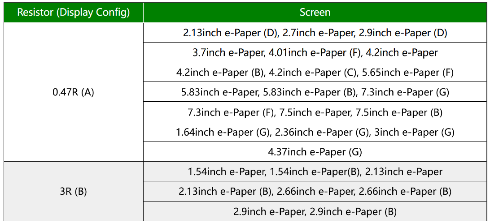

# Verkabelung

## E-Ink von oben 

## ESP von oben

### Board Schalter
Auf unserem ESP32, dem E-Paper ESP32 Driver Board, gibt es einen Schalter, bei dem man A und B aussuchen kann, der Default ist A. In unserem Fall ist es auch A aber es hängt wie man unten sehen kann vom verwendeten Bildschirm ab. Außerdem kann man zwischen ON und OFF aussuchen. Hier kann der USB-Port zum Strom sparen deaktivieren. Zum Hochladen von neuem Code muss es dann natürlich auf ON sein. 
 

## Kabel zur Verbindung zwischen E-Ink und ESP32

## Verkabelung ESP32, E-Ink und Computer

Um den Programmcode auf den ESP32 zu laden, muss der ESP32 per Mikro-USB-Kabel mit dem Computer verbunden werden.

## Verkabelung ESP32, E-Ink und Battery

Das schwarze Kabel muss an den oberen linken Pin "GND" und das rote Kabel muss an den rechten Pin 3V3.

## Akkus und Batterien

### Arten

Es gibt viele Arten von Batterien, die in Frage kommen aber gute Optionen gibt es in unserem Fall nicht so viele.  

Normale Alkaline Batterien verlieren schnell an Spannung und können die Mindestspannung des ESP32 2,5V nicht lange gewährleisten, Sie erreichen 2,55V schon nach 30% Kapazitätsverlust. 

Powerbanks sind eine einfache Lösung aber für unsern Fall möchten wir Deep Sleep verwenden, in diesem Zustand verbraucht der ESP32 kaum Strom und die meisten Powerbanks schalten sich dann aus, um den Akku, den sie normalerweise aufladen zu schützen. In unserem Fall bedeutet das aber das der ESP32 nicht funktioniert. 

Lithium Akkus bieten genug Strom aber zu viel Spannung, man bräuchte einen Spannungsregler. Dieser würde aber viel Strom in der Umwandlung verschwenden und wir hätten eine niedrigere Laufzeit.  

Am Ende haben wir uns für Lithium AA Batterien entscheiden. Lithium Batterien halten lange die Spannung eine 1,5V Batterie bleibt lange bei 1,5V, bei 1,35V sind schon 90% der Kapazität aufgebraucht. Und bei 1,275V leer. Mit jeweils 2 oder 3 Batterien können die jeweiligen Spannungsvoraussetzungen eingehalten werden. 

Alternativ gibt es auch LiFePo Akkus, die eine wiederverwendbare Alternative wären. 

### Verbindungsart 

Es gibt zwei Arten den ESP32 mit Strom zu versorgen, durch den Micro USB 5V oder direkt durch den 3v3 Pin (auch VDD) (+ / Rotes Kabel) und den GND-Pin (Ground) (- / Schwarzes Kabel). 

Die USB-Schnittstelle (5V) verlangt zwischen 3.6V und 5.5V [(1)](https://www.waveshare.com/wiki/E-Paper_ESP32_Driver_Board). 

Bei 3v3 ist eine Spannungsversorgung von 2,5V bis 3,6 V zu gewährleisten. Bei mehr können Komponenten geschädigt werden da der ESP32 Spannungsumwandler umgangen wird. [(1)](https://www.radioshuttle.de/media/tech-infos/esp32-mit-batteriebetrieb/) [(2)](https://diyi0t.com/best-battery-for-esp32/)

### Erwarteter Stromverbrauch ESP32 Driver Board: 

In jedem Modus verbraucht der ESP32 unterschiedlich viel Strom. Daher haben wir folgendermaßen die mAh pro Tag ermittelt. Dabei ist x der erwarteter Verbrauch des Modus in mAh, t die Dauer des Modus in Sekunden und y der Gesamte Verbrauch pro Tag in mAh.

Bei einer Batterielaufzeit von 2900 mAh lässt sich somit eine Laufzeit von ca. 377 Tagen. Diese Zahl ist jedoch mit Vorsicht zu genießen, da aufgrund von Entladung der Batterien durch Umwelteinflüsse und andere Einflussfaktoren der tatsächliche Wert davon abweichen kann.

