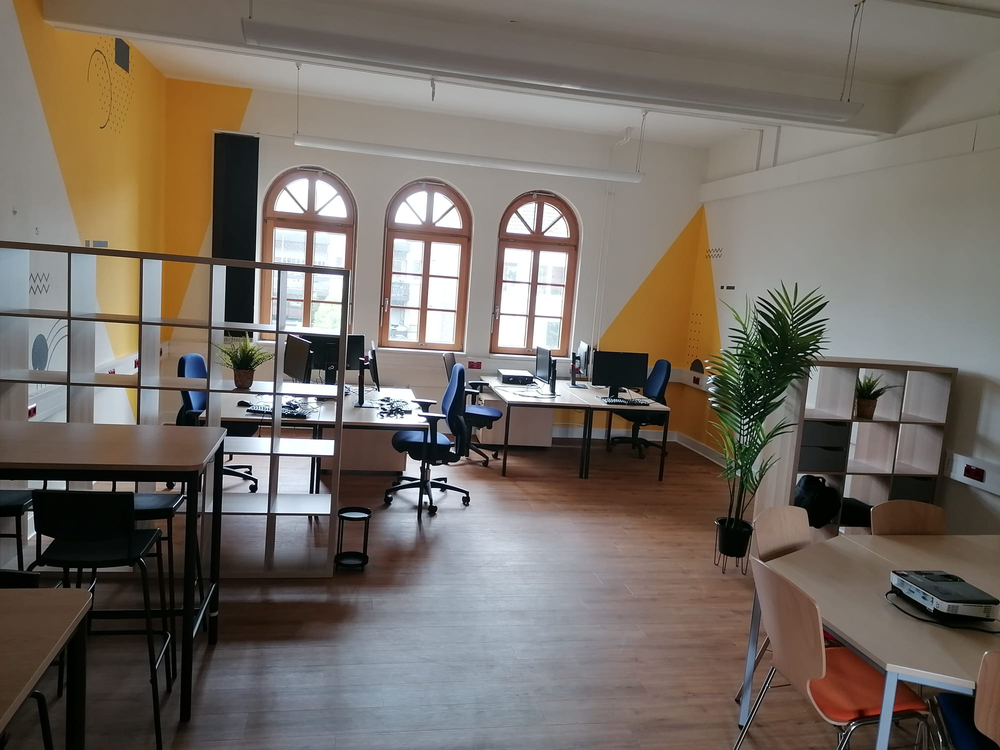
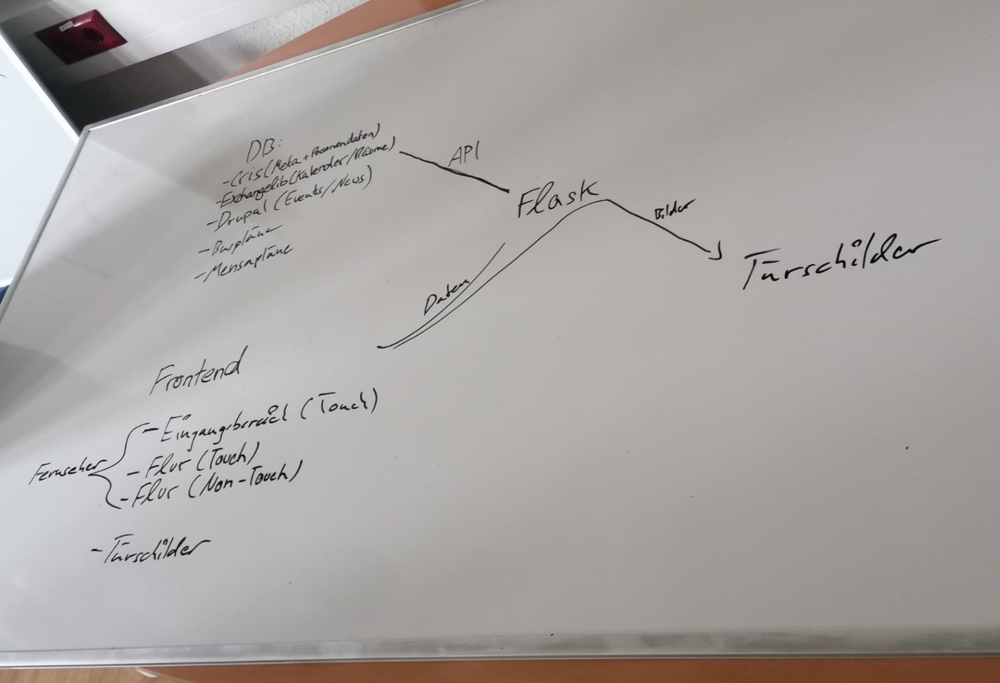

# Einleitung

**HouseTech**

## Projektorganisation
Die Praxisrelevante Problemstellung war es den Leonardo Campus moderner zu gestallten. Bildschirme and den Eingängen des Leonardo-Campus 3 sollten etwas neues anzeigen. Und außerdem für die Studenten, Beschäftigten und Besucher etwas nützliches anzeigen. Die vorherigen Inhalte sind schon veraltet und eine neue alternative wünschenswert. Außerdem war es auch ein Ziel das unsere Arbeit gut nachvollziehbar ist, so dass man in Zukunft versteht was gemacht wurde und gut Änderungen vornehmen kann.
Ein weiteres Ziel war die prototypische Implementierung von Digitalen Türschildern als Ersatz für analoge. 
Nebenbei haben wir einen Blog geführt, um Interessierte über Fortschritte und Herausforderungen der aktuellen Projekt Entwicklung zu informieren.

Mit den Grundlagen haben wir uns schon ganz am Anfang, verteilt, beim Schreiben der Seminararbeiten auseinandergesetzt. Dabei wurden auch bei verschieden Bereichen Anforderungen und erste Ansätze erdacht. Bei Projektanfang haben wir uns getroffen und geplant, wie wir am besten vorgehen und welche Technologien wir benutzen wollen. Beispielsweise haben wir schnell entschieden das wir das flexible Flask Webframework nutzen möchten und das wir zur Kommunikation und Koordination Teams und GitLab benutzen möchten. 

Dann haben wir uns in Teams aufgeteilt, um die verschiedenen Teile des Projektes abzudecken.
Simon und Kevin waren am Frontend beteiligt, Florian und Jingyi waren Backend, Christoph und Ulrich E-Ink Türschildanzeige und Jan hat sich mit dem Server und der GitLab Pipeline beschäftigt. In dieser Aufteilung haben wir auch größtenteils am Projekt gearbeitet wir waren aber auch mehrmals pro Woche in Kontakt und des Weiteren sonst auch sowieso immer über Teams und GitLab erreichbar. Wir haben auch gruppen übergreifend aufgaben verteilt auch, welche für die es keine ursprünglich definierte gruppe gab wie die Raspberry Pi 3 und 4 zur Anzeige unserer neuen Inhalte zu benutzen. Bei der Aufteilung in die Untergruppen haben wir uns sowie an persönlichen Interessen und Stärken als auch am geschätzten Bedarf orientiert.
Wir haben am Anfang gehört das es mit der Dokumentation immer länger braucht als mit dem Projekt an sich, und haben uns deswegen am Anfang, um das zu vermeiden, dazu entschieden die Dokumentation des Codes zum Beispiel von Anfang an mit anzufertigen.

## Vorgehensweise
Die ausgewählten Ziele haben wir dann je nach Bedarf in kleinere Schritte unterteilt und diese dann Schritt für Schritt Implementiert, getestet und in das Projekt integriert. Bei der Anzeige von Türschildern auf E-Ink Displays haben wir beispielsweise erst ein Demo Bild anzeigen lassen, dann ein von uns generiertes und dann später daran gearbeitet die Generierung der Türschilder zu automatisieren.
Durch die Vorbereitung auf die wöchentlichen Jour Fixes haben wir selbst auch immer gut überblick über den Fortschritt und die Entwicklung und erfolgreiche Abarbeitung unserer Ziele erhalten. Und mit dem Feedback konnten wir auch immer wissen in welche Richtung es weitergehen soll. 
Im Rahmen des Projektes haben wir uns intensiv mit Systemen wie CRIS, Drupal und Microsoft Exchange beschäftigt.
Außerdem haben wir am Anfang eine Umfrage betrieben, um zu sehen, was für die Nutzer der Eingangsbildschirme wichtig ist, und auch um zu sehen welche Ideen weniger relevant oder sogar unpopulär sind. Anhand des Feedbacks haben wir dann unsere Ziele und Prioritäten konkretisiert. 
Am Ende des Projektes haben wir nochmal eine Umfrage durchgeführt, in diesem Fall aber um unsere aktuelle Version zu testen und um wieder Feedback zu Fehlern, Nutzbarkeit und Zufriedenheit zu erhalten. Auch um zu sehen, wo noch Handlungsbedarf besteht und um andere Stakeholder wieder am Projekt zu beteiligen.

