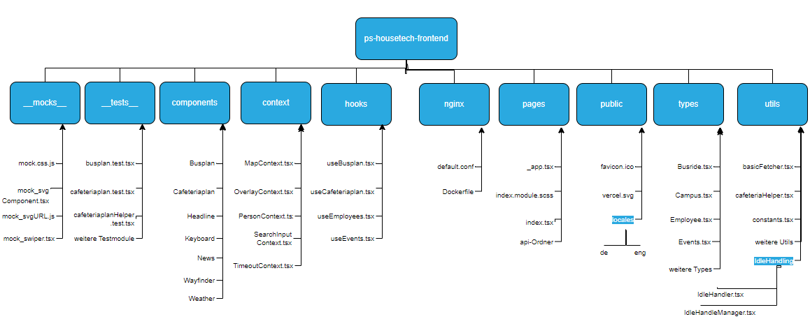

# Einleitung

Die vorliegende Dokumentation beschreibt das Frontend für die Informationsdisplays, welche unter Verwendung von NextJs, einem Open-Source React-Framework, entwickelt wurde. Das Backend spielt eine große Rolle in der Applikation, da es die Benutzeroberfläche zum Interagieren beschreibt.

## Warum Next.Js?

Next.js bietet die Möglichkeit, sowohl serverseitiges Rendern als auch statisches Rendern zu nutzen. Das ist besonders nützlich für eine schnellere Initialisierung der Seiten und eine verbesserte Benutzererfahrung, da Inhalte schneller angezeigt werden können. Das ist gerade in Bezug auf unser Projekt wichtig, da die Displays viele Interaktionsmöglichkeiten bieten.

## Die Struktur des Frontends?

**Anmerkung**: Blaue Rechtecke sind Ordner, blau hinterlegte Textfelder Unterordner. Der Übersicht geschuldet sind nicht alle einzelnen Dateien und Unterordner abgebildet. Die einzelnen Ordner werden in seperaten Seiten behandelt, sodass diese Einleitung lediglich zur Übersicht dient.

Die Struktur des Frontends in Next.js folgt einer vordefinierten Ordnerstruktur, die von Next.js empfohlen wird. Diese Struktur fördert die Trennung von Logik, Komponenten und Seiten, was die Skalierbarkeit, Wartbarkeit und Organisation Ihres Projekts erleichtert. Mehr dazu finden Sie [hier](https://nextjs.org/docs/getting-started/project-structure). Hier ist unsere Ordnerstruktur für das Frontend:

## Root-Directory

Im Wurzelverzeichnis (auch Root Directory genannt) ps-housetech-frontend unseres Projekts finden sich viele Konfigurationsdateien. Diese Dateien enthalten Einstellungen, Parameter und Konfigurationsoptionen, die die Funktionsweise, das Verhalten und die Umgebung es Frontends steuern. [Hier](/website/docs/frontend/konfigurationsdatei.md) sind einige häufige Konfigurationsdateien und wofür sie benötigt werden.

## assets-Directory

Der assets-Ordner dient dazu, alle Arten von statischen Ressourcen zu speichern, die von der Anwendung benötigt werden. Statische Ressourcen sind Dateien, die nicht durch den Server oder die Anwendung generiert werden, sondern unverändert an die Displays gesendet werden. Der assets-Ordner hilft dabei, diese Ressourcen zu organisieren und leicht zugänglich zu machen. Hier liegen beispielsweise Bilder und Schriftarten, aber auch scss-Dateien für das Styling drin.

## \__mocks__-Directory

Ein mocks-Directory (Doppelunterstrich "mocks" Doppelunterstrich) ist ein spezieller Ordner, der dazu dient, Mock-Implementierungen von Modulen oder Abhängigkeiten zu speichern. Mocks werden verwendet, um während des Testens reale Implementierungen von Modulen zu ersetzen und vorhersehbare Verhaltensweisen für Testzwecke zu simulieren.

## \__tests__-Directory

Der Zweck dieses Ordners ist es, einen zentralen Ort für alle Testdateien und Test-Suiten bereitzustellen, um die Wartbarkeit, Übersichtlichkeit und Struktur der Tests zu verbessern.

## components-Directory

In diesem Ordner werden wiederverwendbare React-Komponenten abgelegt. Bei uns sind das zum Beispiel der Busplan, Mensaplan, News usw. Dies fördert die Modulare Entwicklung und Wiederverwendbarkeit, was zu einer klaren Struktur und besseren Testbarkeit führt, da Komponenten u.U. auch alleine getestet werden können.

## context-Directory

Der Context-Ordner kann verwendet werden, um Contexts zu organisieren. Ein Context in Next.Js ermöglicht das Weitergeben von Daten an Komponenten, ohne die Daten durch alle Ebenen der Komponenten-Hierarchie explizit weitergeben zu müssen. Ein Context-Ordner könnte beispielsweise Context-Provider und zugehörige Dateien enthalten.

## hooks-Directory

Im Hooks-Ordner können benutzerdefinierte React Hooks organisiert werden. Hooks sind Funktionen, die es ermöglichen, State und andere React-Funktionalitäten in funktionalen Komponenten zu verwenden.
Dies fördert wiederum die Modularität, sodass die Logik besser strukturiert werden kann. Außerdem wird hier das Fetchen gemanaged. Wir nutzen die SWR-Library zum Fetchen aufgrund der Vorteile wie der Stale-While-Revalidate-Strategie (zwischengespeicherte (stale) Version der Daten wird sofort zurückgegeben, während gleichzeitig eine Aktualisierung (revalidate) im Hintergrund ausgelöst wird) oder dem automatischen Caching.

## nginx-Directory

Der nginx-Ordner kann für die Konfiguration des Nginx-Webservers verwendet werden. Dort liegt auch unser Dockerfile.

## pages-Directory

Ist eine Konvention in Projekten, die Next.js verwenden. Hier werden die Hauptseiten der Anwendung erstellt. Wir haben zwar nur eine Benutzeroberfläche, dennoch haben wir mehrere Seiten, da bei Erweiterung einige Funktionalitäten weiterhin gelten sollen. Dazu mehr im pages-Abschnitt.

## public-Directory

Im public-Ordner befinden sich einerseits die JSONs für die Übersetzungen. Andererseits können dort auch statische Ressourcen wie Bilder, Schriftarten und andere Dateien gespeichert werden. Diese Ressourcen sind öffentlich zugänglich und können über URLs abgerufen werden. Sie werden normalerweise nicht in den Build-Prozess einbezogen und sind nützlich für Ressourcen, die von außerhalb der Anwendung geladen werden müssen. So ist .B. das Logo enthalten, welches man oben im Tab sieht, wenn man die Applikation über den Browser öffnet.

## types-Directory

Der types-Ordner kann dazu verwendet werden, TypeScript-Typendefinitionen für das Projekt zu organisieren. TypeScript ist eine statisch typisierte Erweiterung von JavaScript. Durch die Erstellung von Typendefinitionen können die Typsicherheit in der Anwendung verbessern und die Entwicklungszeitfehler minimieren.

## requests-Ordner

Dort liegt lediglich eine Datei, in der die Bilder der Personen von https://ps-housetech.uni-muenster.de:444/api/picture/ requested werden.

## utils-Directory

In diesem Ordner können Hilfsfunktionen, Konstanten oder Dienstprogramme abgelegt werden, die in verschiedenen Teilen der Anwendung verwendet werden können, wie beispielsweise API-Requests oder Datenverarbeitung wie es beim Cafeteriaplan der Fall ist. Dort wandeln wir z.B. das Datumsformat um.

## .husky-Directory

Der .husky-Ordner im Root-Verzeichnis unseres Projekts wird verwendet, um die Git-Hooks-Konfiguration zu speichern. Git Hooks sind Skripte, die automatisch ausgeführt werden, wenn bestimmte Git-Ereignisse auftreten. Bei unserem Projekt werden in der pre-commit Datei (die einzige Datei des Ordners) automatische Tests oder Linting-Überprüfungen ausgeführt werden, um sicherzustellen, dass der Code den Standards entspricht, bevor er committet wird.

## .gitlab-Directory

Der .gitlab-Ordner im Wurzelverzeichnis unseres Projekts wird verwendet, um spezifische Konfigurationen und Einstellungen für die CI/CD-Pipelines zu speichern. GitLab CI/CD ist ein Tool, das uns ermöglicht, automatisierte Prozesse für die Integration, Tests und Bereitstellung von Code in einem GitLab-Repository einzurichten.
