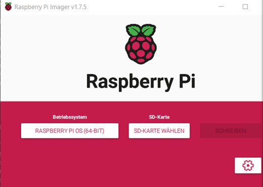
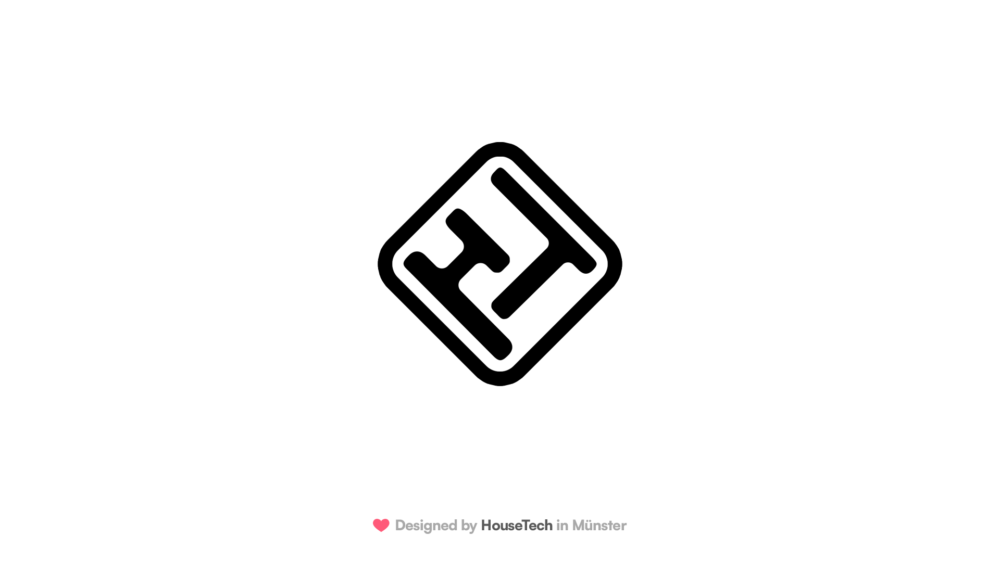

#Raspberry Pi 4 

Für das Projekt wurde uns zuerst, vorübergehend ein Raspberry Pi 3 zur Verfügung gestellt und anschließend ein Raspberry Pi 4. 

##Start

Um beide mit einem Betriebssystem zu bespielen, nutzt man am besten ein Programm am PC das Raspberry PI Imager heißt. Dieses Programm ist auf der [offiziellen Webseite](https://www.raspberrypi.com/software/)  verfügbar 
. Dafür muss man einen SD-Kartenleser haben. Für den Raspberry Pi3 gibt es Raspberry PI OS in 32 Bit und für den Raspberry Pi 4 haben wir die 64 Bit Variante verwendet. In den Einstellungen kann man vor dem Abschließen dann noch die SSID und das Passwort eintragen und DE als Land um einen schnelleren Start zu ermöglichen.

##Anpassungen
Als nächstes müssen noch einige Einstellungen in Dateien der SD-Karte, am PC, in der „config.txt“ Datei angepasst werden. Die Inhalte der config.txt Datei kann man durch diese Inhalte ersetzen: 

[config.txt Datei](./config.txt)
Alles sollte idealerweise in Notepad++ beispielsweise bearbeitet werden, von anderen Programmen wie Wordpad wird abgeraten da sie die Dateien unbrauchbar machen können
  
Letzens fügen wir noch unser LC-housetech Logo ein und ersetzen das Standardbild.  
-	splash.png 
  

Erstens weil sonst kein Bild zuversichtlich angezeigt wird und zweitens, weil die Performance noch zu niedrig war, um alles flüssig anzuzeigen und wir uns deswegen dafür entschieden haben den Raspberry Pi 4 zu übertackten. 
Um die Leistung zu steigern haben wir auch die passiven kühl Blöcke angebracht, die mitgeliefert wurden.
Außerdem scheint es nötig zu sein den ersten HDMI-Port zu nutzen, um ein Bild anzuzeigen. 

##MAC-Adresse ermitteln
 
Um starten zu können haben wir als erstes die MAC-Adresse für WLAN ausfindig gemacht und sie dann Freischalten lassen damit wir zum SUM Netzwerk Zugang haben. Dafür gibt man beim Raspberry Pi im Terminal „ifconfig“ ein und bei der Ausgabe bei „wlan0“ steht sie dann als „ether“ bezeichnet. In unserem Fall ist LAN, „eth0“ nicht relevant. 
Sobald das funktioniert hat, sollte eine Verbindung zum Internet hergestellt sein.

 ##Kioskmodus
Wir haben mehre Kioskanzeigealternativen getestet und bemerkt, dass diese zu merkbaren Leistungs unterschieden führen. 

Um die alternative zu implementieren für die wir uns am Ende entscheiden haben gibt man in der Konsole das Raspberry Pi4
 "
 sudo nano /etc/xdg/lxsession/LXDE-pi/autostart
 " 
ein.
Damit kann man eine Datei aufrufen, in die wir folgendes eintragen müssen:

"

@xset s off
@xset -dpms
@xset s noblank
@chromium-browser --kiosk https://ps-housetech.uni-muenster.de:444/  
# load chromium after boot and open the website in full screen mode

"
Hier tragen wir den link unserer Webseite ein, in diesem Fall: 
-	https://ps-housetech.uni-muenster.de:444/ 
Wenn die Änderungen übernommen wurden wird beim näachten Boot Chromium geladen und dann unsere Website als Vollbild im Kioskmodus angezeigt.

