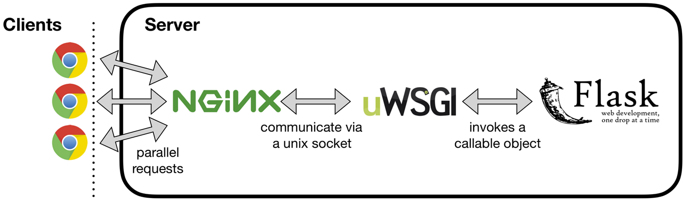
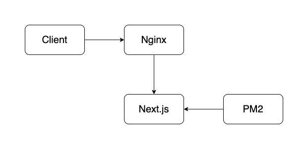

# Server Struktur für Backend, Frontend und Nginx

Willkommen zur technischen Dokumentation unserer Server Struktur! In diesem Dokument werden wir einen Überblick über die Architektur und Konfiguration unserer Server geben, die das Backend, das Frontend und den Nginx-Webserver umfassen.

Unser Ziel ist es, einen klaren Einblick in die Organisation und die Zusammensetzung unserer Serverumgebung zu geben, die es uns ermöglicht, unsere Anwendungen effizient und sicher auszuführen. Durch diese optimierte Struktur können wir eine hohe Leistung, Skalierbarkeit und Zuverlässigkeit unserer Dienste gewährleisten.

In den folgenden Abschnitten werden wir detailliert auf die einzelnen Komponenten eingehen:

1. **Backend-Server:** Hier beschreiben wir die Infrastruktur und die Technologien, die wir für unser Backend verwenden. Wir erklären die Architektur, die für die Verarbeitung, Speicherung und Bereitstellung der Daten unserer Anwendung verantwortlich sind.

2. **Frontend-Server:** In diesem Abschnitt geben wir Einblicke in unsere Frontend-Server, die für die Darstellung und Interaktion mit der Benutzeroberfläche unserer Anwendung verantwortlich sind. Wir erläutern die verwendeten Technologien, Frameworks und bewährte Methoden, um eine reibungslose Benutzererfahrung zu gewährleisten.

3. **Nginx-Webserver:** Hier erläutern wir unseren Nginx-Server, der als Reverse-Proxy fungiert. Wir erklären die Konfiguration und Optimierung von Nginx, um die Anfragen zwischen den Backend- und Frontend-Servern effizient zu verteilen und die Sicherheit unserer Anwendung zu erhöhen.

Unser Ziel ist es, dass nach dem Lesen dieser Dokumentation ein klares Verständnis für unsere Serverarchitektur, wie unsere Technologien zusammenwirken und wie wir die Leistung und Sicherheit unserer Anwendung optimieren, besteht.

## Struktur Backend:

## Struktur Frontend:

